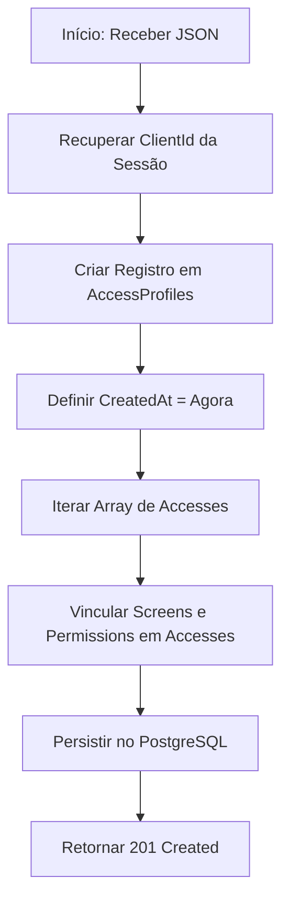

# Módulo de Perfil de Acesso (Access Profile)

Este módulo é responsável por gerenciar as permissões granulares dos usuários dentro do sistema através de uma arquitetura de Controle de Acesso Baseado em Funções (RBAC). Ele define quais telas e quais ações (Criar, Visualizar, Atualizar, Deletar) um perfil específico pode executar.

## Modelagem de Dados (ERD)

A estrutura de dados é composta por quatro tabelas principais que garantem a flexibilidade e escalabilidade do sistema de permissões.

```dbml
Table AccessProfiles {
  Id guid [pk]
  Name string [not null]
  ClientId guid [ref: > Clients.Id]
  IsActive boolean [default: true]
  CreatedAt timestamptz [default: 'now()']
  UpdatedAt timestamptz
  DeletedAt timestamptz
}

Table Screens {
  Id int [pk]
  Key string [not null, unique]
  Title string [not null]
  Description string
  Sidebar string
  Icon string
}

Table Permissions {
  Id int [pk]
  Key string [not null, unique]
  Name string [not null]
}

Table Accesses {
  AccessProfileId guid [pk, ref: > AccessProfiles.Id]
  ScreenId int [pk, ref: > Screens.Id]
  PermissionId int [pk, ref: > Permissions.Id]
}
```

---

## Regras de Autorização e RBAC

Todos os endpoints deste módulo exigem autenticação via Bearer Token e validam permissões específicas associadas à tela `access_profile`.

| Ação | Permissão Requerida | Descrição |
| :--- | :--- | :--- |
| **Listar/Obter** | `view` | O usuário deve ter permissão de visualização na tela `access_profile`. |
| **Criar** | `create` | O usuário deve ter permissão de criação na tela `access_profile`. |
| **Atualizar** | `update` | O usuário deve ter permissão de atualização na tela `access_profile`. |
| **Excluir** | `delete` | O usuário deve ter permissão de deleção na tela `access_profile`. |

---

## Endpoints e Regras de Negócio

A API gerencia automaticamente a hierarquia **Multi-tenant**. O `ClientId` não é enviado pelo Web; a API o recupera a partir da sessão do usuário autenticado para garantir o isolamento total dos dados.

### 1. Listar Perfis de Acesso
`GET /access-profiles`

Retorna todos os perfis vinculados ao `ClientId` do usuário autenticado que não foram excluídos logicamente, junto com os metadados da tela.

**Estrutura de Resposta:**
```json
{
  "screen": {
    "title": "Perfis de Acesso",
    "description": "Gerencie as permissões e níveis de acesso do sistema."
  },
  "data": [
    {
      "id": "guid",
      "name": "Administrador",
      "isActive": true,
      "createdAt": "...",
      "updatedAt": "..."
    }
  ]
}
```

> [!IMPORTANT]
> A consulta ao banco deve obrigatoriamente incluir um filtro `WHERE ClientId = @UserClientId` para evitar vazamento de dados entre organizações. A API deve buscar os metadados da tela `access_profile`.

---

### 2. Criar Perfil de Acesso
`POST /access-profiles`

Cria um novo perfil e estabelece os vínculos de permissões.

**Regras:**
- O `ClientId` do novo perfil deve ser obrigatoriamente o do usuário autenticado.
- Exige permissão `create` na tela `access_profile`.

#### Fluxo de Execução


---

### 3. Atualizar Perfil de Acesso
`PUT /access-profiles/{id}`

Atualiza os dados básicos do perfil e sincroniza a matriz de permissões.

**Regras de Segurança:**
- **Validação de Posse**: A API deve primeiro verificar se o perfil com o `Id` informado pertence ao `ClientId` do usuário autenticado. Se não pertencer, retorna `404 Not Found` (mesmo se o ID existir em outro inquilino).
- **Autorização**: Exige permissão `update` na tela `access_profile`.

**Comportamento:**
- Atualiza o campo `UpdatedAt`.
- Remove os vínculos antigos na tabela `Accesses` e insere os novos enviados no JSON.

---

### 4. Excluir Perfil de Acesso (Soft Delete)
`DELETE /access-profiles/{id}`

Realiza a exclusão lógica do perfil.

**Regras de Segurança:**
- **Validação de Posse**: O perfil deve pertencer ao `ClientId` do usuário autenticado.
- **Autorização**: Exige permissão `delete` na tela `access_profile`.
- **Não há deleção física**: O campo `DeletedAt` é preenchido com o timestamp atual.

---

## Estrutura de Dados (JSON)

O Frontend envia um objeto consolidado, e a API é responsável por distribuir os dados entre as tabelas `AccessProfiles` e `Accesses`.

### AccessProfileRequest
```json
{
  "name": "Gerente de Campanha",
  "isActive": true,
  "accesses": [
    {
      "screenId": 1,
      "permissionId": 1
    },
    {
      "screenId": 5,
      "permissionId": 1
    },
    {
      "screenId": 5,
      "permissionId": 2
    }
  ]
}
```

---

## Sincronização de Sessão (Redis)

Para garantir alta performance nas validações de RBAC, as permissões do usuário são injetadas na sessão do Redis durante os processos de:
1. **Sign-In**: Ao logar, a API busca a matriz completa de `Accesses` do perfil e a anexa ao objeto de sessão.
2. **Refresh**: Ao renovar o token, os dados de permissão são recarregados do PostgreSQL para o Redis, garantindo que mudanças no perfil reflitam quase imediatamente no acesso do usuário.

---

## Configuração Inicial e Seed

A API deve ser inicializada com os dados mestres de telas e permissões para garantir a integridade referencial.

### Screens Seed
Baseado em `screens.json`, incluindo chaves como:
- `dashboard`, `regional_planning`, `organization_profile`, `user_registration`, `access_profile`.

### Permissions Seed
Baseado em `permissions.json`:
- `view` (1), `update` (2), `delete` (3), `create` (4).

---

## Validação e Testes

| Cenário | Endpoint | Resultado Esperado | Validação Adicional |
| :--- | :--- | :--- | :--- |
| **Criação Sucesso** | `POST /` | `201 Created` | Verificar se `ClientId` foi injetado corretamente. |
| **Update Sem Permissão** | `PUT /{id}` | `403 Forbidden` | Tentar atualizar sem a permissão `update`. |
| **Acesso Cross-tenant** | `GET /{id}` | `404 Not Found` | Tentar acessar ID de outro cliente. |
| **Soft Delete** | `DELETE /{id}` | `200 OK` | Verificar se `DeletedAt` != null no DB. |

---

## Status da Implementação

- [ ] Criação dos Models `Screen`, `Permission` e `Access`.
- [ ] Implementação do Controller com validação de RBAC.
- [ ] Lógica de injeção automática de `ClientId`.
- [ ] Configuração de Soft Delete no `DbContext`.
- [ ] DatabaseSeeder atualizado com JSONs de Screens e Permissions.
