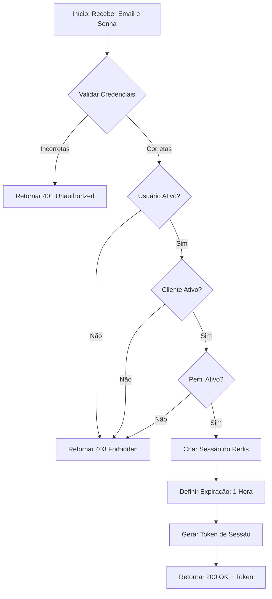
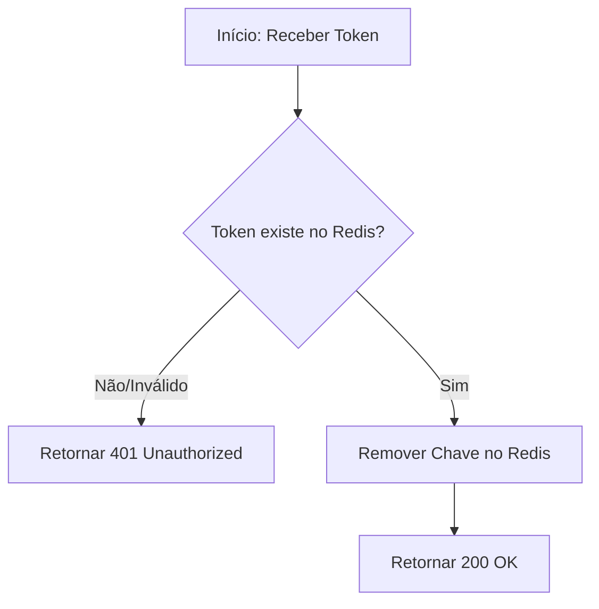
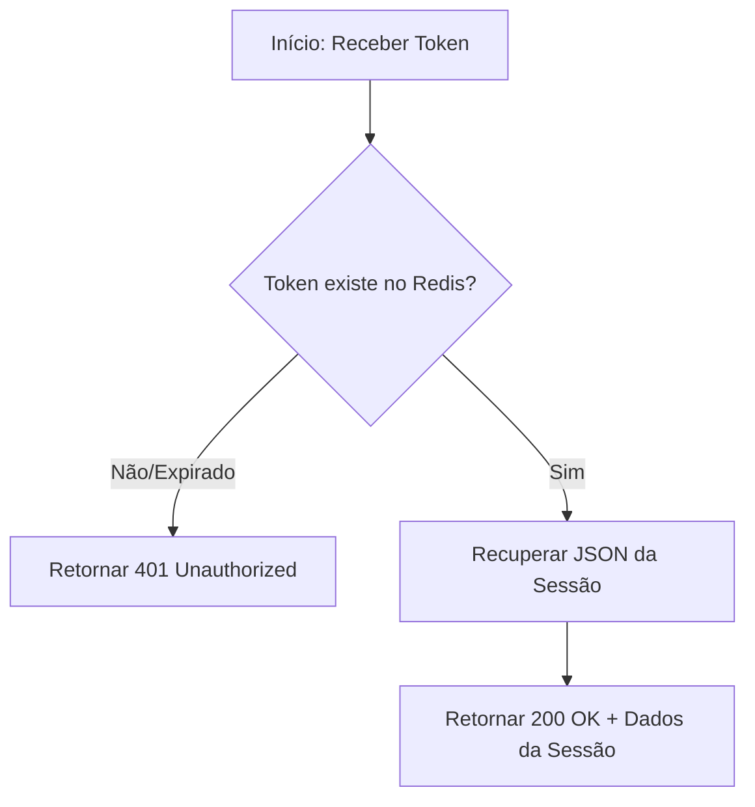

# Módulo de Autenticação (Auth)

Este módulo é responsável por garantir a segurança no acesso à API, gerenciar sessões de usuários via Redis e prover mecanismos de logout seguro.

## Modelagem de Dados (ERD)

O diagrama abaixo representa a estrutura de tabelas no banco de dados PostgreSQL, utilizando tipos nativos para garantir a integridade dos dados. A tabela de usuários segue o padrão **ASP.NET Core Identity**.

```dbml
Table AspNetUsers {
  Id guid [pk]
  Name string [not null]
  Email string [not null]
  PasswordHash string [not null]
  ClientId guid [ref: > Clients.Id]
  AccessProfileId guid [ref: > AccessProfiles.Id]
  IsActive boolean [default: true]
  CreatedAt timestamptz [default: 'now()']
  UpdatedAt timestamptz
  DeletedAt timestamptz
}

Table Clients {
  Id guid [pk]
  Name string [not null]
  Domain string [not null]
  IsActive boolean [default: true]
  CreatedAt timestamptz [default: 'now()']
  UpdatedAt timestamptz
  DeletedAt timestamptz
}

Table AccessProfiles {
  Id guid [pk]
  Name string [not null]
  ClientId guid [ref: > Clients.Id]
  IsActive boolean [default: true]
  CreatedAt timestamptz [default: 'now()']
  UpdatedAt timestamptz
  DeletedAt timestamptz
}
```

---

## Endpoints

### 1. Autenticação (Sign-In)
`POST /auth/sign-in`

#### Fluxo de Execução (Lógica Interna da API)



- **Request Body**: JSON contendo `email` e `password`.
- **Validações**: A API verifica sequencialmente o estado do Usuário (`boolean`), do Cliente vinculado (`boolean`) e do Perfil de acesso (`boolean`).
- **Sessão**: Os dados do usuário, cliente e perfil, incluindo a **matriz completa de permissões** (Screens e Permissions), são serializados e armazenados no Redis usando o Token como chave. Isso permite validações de RBAC de alta performance sem novas consultas ao PostgreSQL.

---

### 2. Encerramento de Sessão (Sign-Out)
`POST /auth/sign-out`

#### Fluxo de Execução



**Comportamento da API:**
- **Header**: Espera o token de autorização.
- **Ação**: A API remove imediatamente a entrada correspondente no Redis, invalidando a sessão.

---

### 3. Validação de Sessão (Me)
`GET /auth/me`

#### Fluxo de Execução


**Comportamento da API:**
- **Finalidade**: Permite que o front-end valide se o token ainda é válido no Redis e recupere os dados do usuário logado (UserId, Name, ClientDomain, etc.) sem consultar o banco de dados principal.
- **Resposta**: Retorna o JSON que foi persistido no Redis durante o login.

---

## Estruturas de Dados (JSON)

A API utiliza o padrão **camelCase** para as propriedades JSON nas respostas.

### SignInResponse
```json
{
  "token": "string (guid)",
  "userId": "string (guid)",
  "userName": "string",
  "clientId": "string (guid)",
  "clientDomain": "string",
  "accessProfileId": "string (guid)",
  "accessProfileName": "string",
  "permissions": [
    {
      "screen": "access_profile",
      "key": "view"
    },
    {
      "screen": "access_profile",
      "key": "create"
    }
  ]
}
```

---

## Validação e Testes

Para garantir a confiabilidade do módulo de autenticação, os seguintes cenários de teste devem ser implementados:

### Testes de Sign-In
| Cenário | Entrada | Resultado Esperado | Validação Adicional |
| :--- | :--- | :--- | :--- |
| **Sucesso** | Credenciais Válidas + Status Ativos | `200 OK` | Verificar se a chave foi criada no Redis com TTL de 1h. |
| **Senha Incorreta** | E-mail certo + Senha errada | `401 Unauthorized` | Nenhuma sessão deve ser criada no Redis. |
| **Usuário Inexistente** | E-mail não cadastrado | `401 Unauthorized` | Proteção contra enumeração de usuários. |
| **Usuário Inativo** | Credenciais OK + `IsActive: false` | `403 Forbidden` | Mensagem: "Usuário inativo". |
| **Cliente Inativo** | Credenciais OK + Cliente inativo | `403 Forbidden` | Mensagem: "Cliente inativo". |
| **Perfil Inativo** | Credenciais OK + Perfil inativo | `403 Forbidden` | Mensagem: "Perfil de acesso inativo". |
| **Payload Malformado** | JSON inválido ou campos vazios | `400 Bad Request` | Verificar mensagens de erro de validação. |

### Testes de Sign-Out e Me
| Cenário | Entrada | Resultado Esperado | Validação Adicional |
| :--- | :--- | :--- | :--- |
| **Logout Sucesso** | Token Válido | `200 OK` | Confirmar que a chave foi removida do Redis. |
| **Me Sucesso** | Token Válido | `200 OK` | Validar se o JSON retornado coincide com o gerado no login. |
| **Token Expirado** | Token inexistente no Redis | `401 Unauthorized` | Garantir que o sistema não permita acesso. |

---

## Segurança e Proteções

Para mitigar ataques comuns e garantir a robustez do sistema, as seguintes proteções estão configuradas na API:

### 1. Rate Limiting (auth-limit)
- **Política**: Janela fixa de 1 minuto.
- **Limite**: 5 requisições por janela.
- **Escopo**: Aplicado ao endpoint `/auth/sign-in`.
- **Resposta**: `429 Too Many Requests`.

### 2. CORS (Cross-Origin Resource Sharing)
- **Política**: `WebClient`.
- **Origem Permitida**: `http://localhost:3000`.
- **Métodos**: Todos os métodos necessários (GET, POST, etc.).

### 3. Account Lockout
Utilizando ASP.NET Identity:
- **MaxFailedAccessAttempts**: 5.
- **DefaultLockoutTimeSpan**: 15 minutos.

### 4. Swagger & Documentação
- **Autenticação**: Suporte a Bearer Token via botão "Authorize".
- **XML Documentation**: Todos os controladores e DTOs possuem comentários XML para descrições detalhadas no Swagger UI.

---

## Configuração Inicial (DatabaseSeeder)

A API utiliza a classe `DatabaseSeeder` para garantir que o ambiente de desenvolvimento esteja pronto:

1.  **Migrações Automáticas**: A API executa `context.Database.Migrate()` ao iniciar.
2.  **Cliente Padrão**: Cria o cliente com `Domain: main`.
3.  **Perfil de Acesso**: Cria o perfil `Administrador`.
4.  **Usuário Admin**: Cria o usuário utilizando as credenciais definidas em `ADMIN_EMAIL` e `ADMIN_PASSWORD` no arquivo `.env`.

> [!IMPORTANT]
> A senha do administrador deve conter pelo menos 6 caracteres e seguir as políticas de complexidade configuradas no `Program.cs`.
> [!NOTE]
> A API utiliza o padrão **ASP.NET Core Identity**, estendendo a classe `IdentityUser` com os campos `ClientId` e `AccessProfileId`.
