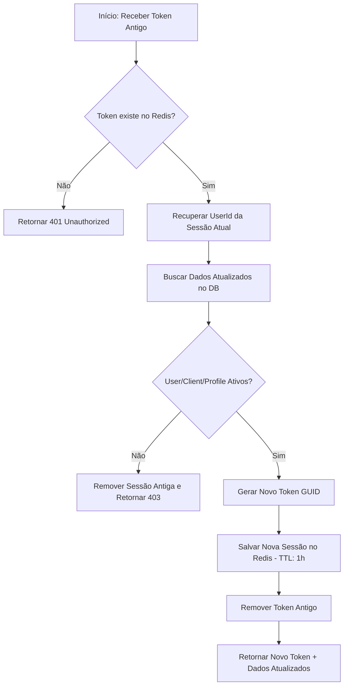

# Módulo de Autenticação e Sessão (Authorization)

Este módulo é responsável por gerenciar a identidade do usuário, o controle de acesso baseado em múltiplos inquilinos (Multi-tenancy) e a persistência de sessões utilizando **Redis**.

## Visão Geral

A autenticação é baseada em tokens GUID temporários armazenados no Redis. Cada token mapeia para um objeto de sessão que contém dados críticos do usuário, cliente e perfil de acesso, evitando consultas repetitivas ao banco de dados PostgreSQL em cada requisição.

### Estrutura da Sessão (Redis JSON)

```json
{
  "UserId": "guid",
  "UserName": "string",
  "ClientId": "guid",
  "ClientDomain": "string",
  "AccessProfileId": "guid",
  "AccessProfileName": "string"
}
```

---

## Endpoints de Autenticação

### 1. Autenticação (Sign In)
`POST /auth/sign-in`

Realiza a validação das credenciais e inicia uma nova sessão.

**Request Body:**
```json
{
  "email": "usuario@exemplo.com",
  "password": "SenhaSegura@123"
}
```

**Comportamento:**
1. Valida Email e Senha via `UserManager`.
2. Verifica se o **Usuário**, **Cliente** e **Perfil de Acesso** estão ativos (`IsActive == true`).
3. Gera um Token GUID único.
4. Armazena os dados da sessão no Redis com TTL de **1 hora**.
5. Retorna os dados completos da sessão e o token.

---

### 2. Encerramento de Sessão (Sign Out)
`POST /auth/sign-out`

Invalida o token de sessão atual.

**Headers:**
- `Authorization: Bearer <token>`

**Comportamento:**
- Remove a chave correspondente ao token do Redis.
- Retorna `200 OK` mesmo se o token já estiver expirado (idempotência).

---

### 3. Obter Dados da Sessão (Get Me)
`GET /auth/me`

Retorna os dados da sessão atual persistidos no Redis.

**Headers:**
- `Authorization: Bearer <token>`

**Resposta (200 OK):**
Retorna o objeto JSON da sessão conforme descrito na seção [Visão Geral](#visão-geral).

---

### 4. Recarregar e Renovar Sessão (Refresh / Reload)
`POST /auth/refresh`

Este endpoint é utilizado para validar a sessão atual e gerar um novo token, sincronizando os dados com o estado mais recente do banco de dados.

#### Motivação
- **Sincronização de Dados**: Se o nome do usuário, o domínio do cliente ou as permissões do perfil de acesso mudarem, este endpoint atualiza a sessão sem exigir um novo login.
- **Segurança (Token Rotation)**: Mantém a sessão ativa trocando o token antigo por um novo, dificultando o sequestro de sessão.
- **Extensão de TTL**: Reinicia o contador de expiração (TTL) no Redis.

#### Fluxo de Execução


**Headers:**
- `Authorization: Bearer <token_antigo>`

**Resposta (200 OK):**
```json
{
  "token": "novo-guid-token",
  "userId": "guid",
  "userName": "Nome Atualizado",
  "clientId": "guid",
  "clientDomain": "novo-dominio",
  "accessProfileId": "guid",
  "accessProfileName": "Perfil Atualizado"
}
```

**Regras de Negócio:**
- O token antigo é invalidado imediatamente após a geração do novo.
- Se o usuário ou cliente tiver sido desativado desde o último login, a sessão é destruída e o acesso negado.

---

## Validação e Erros Comuns

| Status Code | Causa | Mensagem Sugerida |
| :--- | :--- | :--- |
| `401 Unauthorized` | Token ausente, inválido ou expirado no Redis. | "Sessão inválida ou expirada" |
| `403 Forbidden` | Usuário, Cliente ou Perfil marcado como inativo. | "Acesso negado: conta inativa" |
| `429 Too Many Requests` | Excesso de tentativas de login (Rate Limiting). | "Muitas tentativas. Tente novamente em breve." |

---

## Status da Implementação

- [x] Endpoints base (`sign-in`, `sign-out`, `me`) documentados e funcionais.
- [ ] Implementação do endpoint de `refresh` (Aguardando desenvolvimento).
- [x] Integração com Redis para persistência de estado.
- [x] Validação de hierarquia Multi-tenant (User -> Client).
