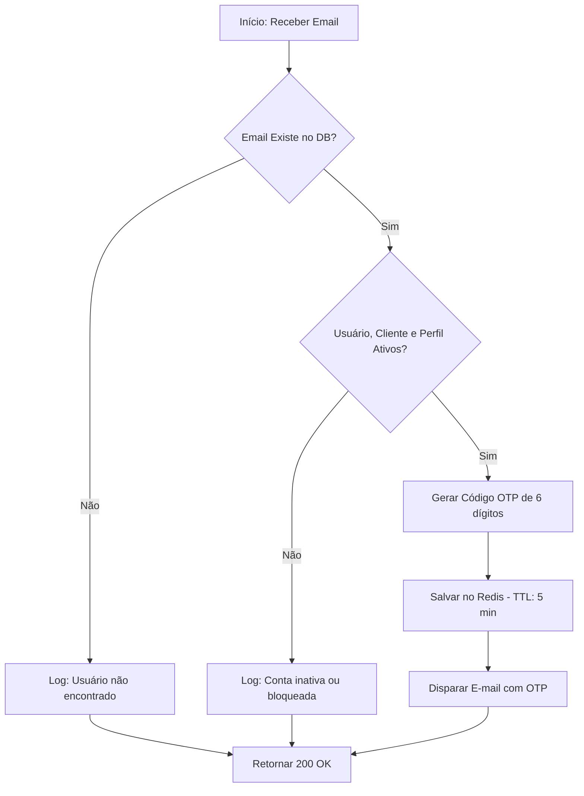
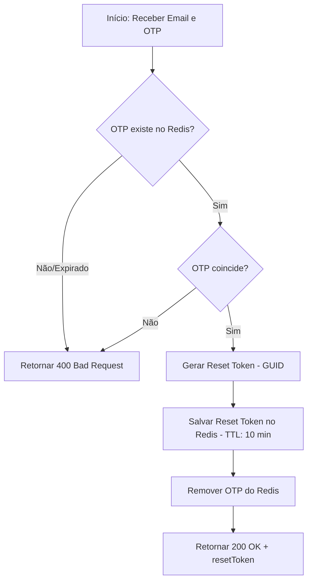
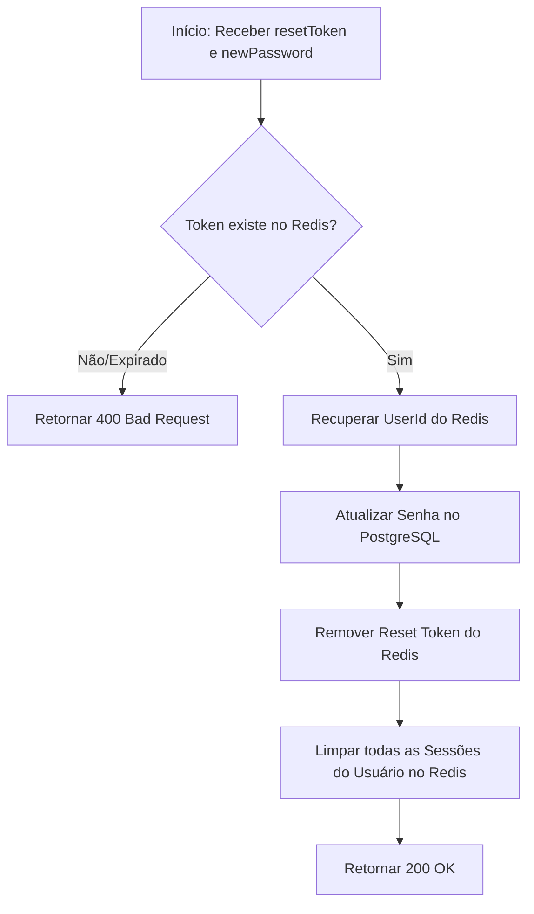

# Módulo de Recuperação de Senha (Password Recovery)

Este módulo é responsável por prover um fluxo seguro de recuperação de acesso para usuários que esqueceram suas senhas, utilizando verificação via **Código OTP (One-Time Password)** enviado por e-mail e persistido no Redis.

## Modelagem de Dados e Dependências

Para a implementação deste módulo, a API interage com as tabelas fundamentais de identidade e utiliza facilitadores nativos do ecossistema .NET.

### Modelagem de Dados (DBML)

```dbml
Table AspNetUsers {
  Id guid [pk]
  Name string [not null]
  Email string [not null]
  PasswordHash string [not null]
  ClientId guid [ref: > Clients.Id]
  AccessProfileId guid [ref: > AccessProfiles.Id]
  IsActive boolean [default: true]
  CreatedAt timestamptz [default: 'now()']
  UpdatedAt timestamptz
  DeletedAt timestamptz
}

Table Clients {
  Id guid [pk]
  Name string [not null]
  Domain string [not null]
  IsActive boolean [default: true]
  CreatedAt timestamptz [default: 'now()']
  UpdatedAt timestamptz
  DeletedAt timestamptz
}

Table AccessProfiles {
  Id guid [pk]
  Name string [not null]
  ClientId guid [ref: > Clients.Id]
  IsActive boolean [default: true]
  CreatedAt timestamptz [default: 'now()']
  UpdatedAt timestamptz
  DeletedAt timestamptz
}
```

### Facilitadores ASP.NET Core
- **`UserManager<ApplicationUser>`**: Utilizado para buscar usuários, gerenciar o bloqueio de contas e realizar a troca segura da senha.
- **`IdentityOptions`**: Utilizado para validar se a nova senha atende aos requisitos de complexidade (tamanho, caracteres especiais, etc.) configurados no `Program.cs`.
- **`Rate Limiting`**: Middleware nativo para proteger os endpoints de brute-force.
- **`ILogger`**: Para auditoria de eventos críticos (tentativas de recuperação, trocas de senha).

## Fluxo de Recuperação

O processo é dividido em três etapas principais para garantir a segurança e evitar a enumeração de contas:

### 1. Solicitação de Recuperação (Forgot Password)
`POST /auth/forgot-password`

#### Fluxo de Execução


**Comportamento da API:**
- **Request Body**: `{ "email": "string" }`
- **Segurança**: A API sempre retorna `200 OK` independente da existência do e-mail, protegendo contra ataques de enumeração.
- **Persistência**: O código é salvo no Redis com a chave `otp:{email}` e valor contendo o `userId`.

---

### 2. Verificação de Código (Verify OTP)
`POST /auth/verify-otp`

#### Fluxo de Execução


**Comportamento da API:**
- **Request Body**: `{ "email": "string", "otp": "string" }`
- **Resultado**: Em caso de sucesso, retorna um `resetToken` temporário que deve ser usado na próxima etapa.

---

### 3. Redefinição de Senha (Reset Password)
`POST /auth/reset-password`

#### Fluxo de Execução


**Comportamento da API:**
- **Request Body**: `{ "resetToken": "string", "newPassword": "string" }`
- **Ação Adicional**: Ao redefinir a senha, todas as sessões ativas do usuário são invalidadas no Redis (Force Logout), garantindo que dispositivos antigos percam o acesso imediatamente.

---

## Estruturas de Dados (JSON)

### ForgotPasswordRequest
```json
{
  "email": "usuario@exemplo.com"
}
```

### VerifyOtpRequest
```json
{
  "email": "usuario@exemplo.com",
  "otp": "123456"
}
```

### ResetPasswordRequest
```json
{
  "resetToken": "550e8400-e29b-41d4-a716-446655440000",
  "newPassword": "NovaSenha@123"
}
```

---

## Validação e Testes

| Cenário | Endpoint | Entrada | Resultado Esperado | Validação Adicional |
| :--- | :--- | :--- | :--- | :--- |
| **Solicitação Sucesso** | `/forgot-password` | E-mail Válido | `200 OK` | Verificar envio de e-mail e chave no Redis. |
| **Email Inexistente** | `/forgot-password` | E-mail Inválido | `200 OK` | Garantir que nenhum e-mail foi enviado. |
| **OTP Correto** | `/verify-otp` | Email + OTP Certo | `200 OK` | Verificar geração do `resetToken` no Redis. |
| **OTP Incorreto** | `/verify-otp` | Email + OTP Errado | `400 Bad Request` | Mensagem: "Código inválido ou expirado". |
| **Reset Sucesso** | `/reset-password` | Token + Senha | `200 OK` | Confirmar alteração no DB e deleção de sessões. |
| **Token Expirado** | `/reset-password` | Token antigo | `400 Bad Request` | Garantir que a senha não foi alterada. |

---

## Status da Implementação

- [x] Implementação dos Endpoints `ForgotPassword`, `VerifyOtp` e `ResetPassword`.
- [x] Integração com Redis para armazenamento de OTP e ResetToken.
- [x] Serviço de E-mail (SmtpEmailService) configurado.
- [x] Auditoria e Logs de segurança integrados.
- [x] Cobertura de testes unitários (`PasswordTests.cs`) aprovada.