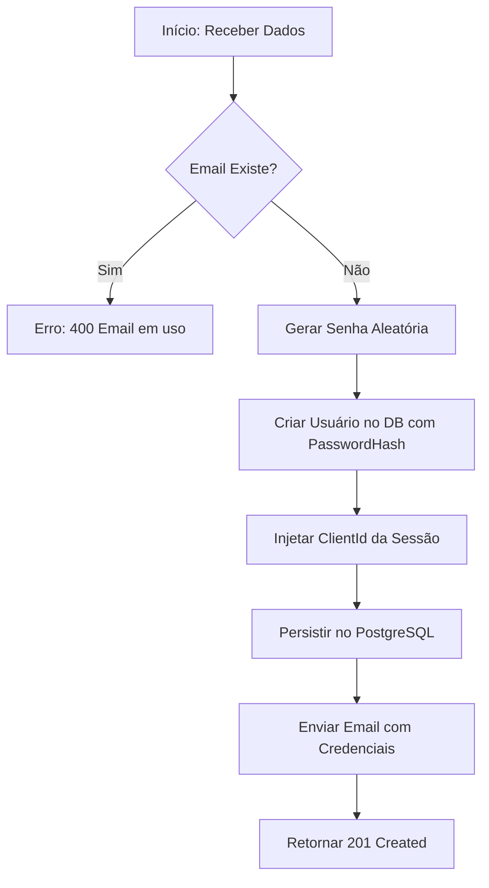

# Módulo de Cadastro de Usuários (User Registration)

Este módulo é responsável por gerenciar os usuários que possuem acesso ao sistema, vinculando-os a perfis de acesso específicos e garantindo o isolamento de dados entre diferentes organizações (Multi-tenancy).

## Modelagem de Dados (ERD)

A tabela de usuários estende a base do ASP.NET Core Identity, adicionando campos específicos de negócio e auditoria.

```dbml
Table ApplicationUsers {
  Id guid [pk]
  Name string [not null]
  Email string [not null, unique]
  PasswordHash string [not null]
  ClientId guid [ref: > Clients.Id]
  AccessProfileId guid [ref: > AccessProfiles.Id]
  IsActive boolean [default: true]
  CreatedAt timestamptz [default: 'now()']
  UpdatedAt timestamptz
  DeletedAt timestamptz
}
```

---

## Regras de Autorização e RBAC

Todos os endpoints deste módulo validam permissões associadas à tela `user_registration`.

| Ação | Permissão Requerida | Descrição |
| :--- | :--- | :--- |
| **Listar/Obter** | `view` | Permite visualizar a lista de usuários da organização. |
| **Criar** | `create` | Permite cadastrar novos colaboradores. |
| **Atualizar** | `update` | Permite editar dados de usuários existentes. |
| **Excluir** | `delete` | Permite realizar a exclusão lógica de um usuário. |

---

## Endpoints e Regras de Negócio

### 1. Listar Usuários
`GET /users`

Retorna todos os usuários vinculados ao `ClientId` do usuário autenticado, acompanhados dos metadados da tela para preenchimento da interface.

**Estrutura de Resposta:**
```json
{
  "screen": {
    "title": "Cadastro de Usuários",
    "description": "Gerencie os usuários que têm acesso ao sistema."
  },
  "data": [
    {
      "id": "guid",
      "name": "João Silva",
      "email": "joao@exemplo.com",
      "accessProfileId": "guid",
      "accessProfileName": "Administrador",
      "isActive": true,
      "createdAt": "2024-05-11T..."
    }
  ]
}
```

> [!IMPORTANT]
> A API deve buscar os dados da tabela `Screens` onde `Key == 'user_registration'` para preencher o objeto `screen`.

---

### 2. Criar Usuário
`POST /users`

Realiza o cadastro de um novo colaborador e dispara o fluxo de boas-vindas.

**Regras:**
- **Unicidade de Email**: O email deve ser único em todo o sistema. Não pode repetir nem com usuários excluídos (`DeletedAt != null`), nem entre clientes diferentes.
- **ClientID Automático**: O `ClientId` do novo usuário é injetado pela API com base na sessão do criador.
- **Geração de Senha**: A API deve gerar uma senha aleatória segura (mínimo 8 caracteres, incluindo símbolos).
- **Notificação**: Após o sucesso na persistência, a API deve enviar um e-mail transacional contendo o Login (email) e a Senha gerada.

**Fluxo de Execução:**


---

### 3. Atualizar Usuário
`PUT /users/{id}`

Atualiza os dados de um usuário existente.

**Regras de Segurança:**
- **Validação de Posse**: O usuário alvo deve pertencer ao mesmo `ClientId` do administrador.
- **Inativação Imediata**: Se o campo `IsActive` for alterado para `false`, a API deve invalidar imediatamente qualquer sessão ativa deste usuário no **Redis**.

---

### 4. Excluir Usuário (Soft Delete)
`DELETE /users/{id}`

Realiza a exclusão lógica do registro.

**Comportamento:**
- Preenche `DeletedAt` com o timestamp atual.
- Define `IsActive = false`.
- **Anulação de Sessão**: Deve remover imediatamente a chave de sessão do usuário no **Redis** para que ele seja desconectado instantaneamente em qualquer dispositivo.

---

## Regras Críticas de Implementação

1.  **Email Globalmente Único**: A validação de unicidade de email no `Identity` deve ignorar o `DeletedAt` (ou seja, se um email foi deletado, ele ainda conta como existente para evitar reutilização de emails históricos que podem estar em logs ou backups).
2.  **Segurança de Senha**: Usuários criados administrativamente devem ser forçados a alterar a senha no primeiro acesso (campo `MustChangePassword` ou lógica similar no Login).
3.  **Gestão de Sessão (Redis)**:
    - Chave no Redis: `session:{userId}`.
    - Ao inativar ou deletar, executar `DEL session:{userId}`.

---

## Checklist de Implementação (API)

- [x] Validação de unicidade global de Email (incluindo Soft Deleted).
- [x] Serviço de Geração de Senha Aleatória.
- [x] Integração com Serviço de Email Transacional.
- [x] Lógica de Invalidação de Sessão no Redis ao alterar `IsActive` ou deletar.
- [x] Controller com mapeamento de permissões da tela `user_registration`.
- [x] Filtro Multi-tenant rigoroso no `GET` e `PUT`.
