# Faveira Calculadora Ambiental

**Número:** 00001  
**Analista responsável:** Samira Lopes  
**Entrada:** 30/01/2026  
**Diretoria:** [Preencher] | **Setor:** [Preencher]  
**Link:** [Preencher]  
**Protótipo:** [Preencher]

---

## Histórico de Versões

| ID | Data e hora | Responsável | Alteração |
| :--- | :--- | :--- | :--- |
| 1.0 | 30/01/2026 | Samira Lopes | Criação inicial do documento |

---

## 1. Introdução

### Visão Geral do Projeto
A **Plataforma Integrada de Regularização e Incentivo Ambiental** é uma solução tecnológica projetada para gerenciar o ciclo de vida da conformidade ambiental de imóveis rurais. Diferente de sistemas puramente fiscalizatórios, esta solução adota uma abordagem orientada a resultados, integrando a regularização de passivos ambientais a um modelo de incentivos econômicos e reputacionais.

O sistema centraliza a governança de dados ambientais, permitindo que proprietários transitem de uma situação de irregularidade para um cenário de conformidade ativa, habilitando o acesso a benefícios como créditos diferenciados e participação em mercados de ativos verdes.

### Objetivos do Sistema
O objetivo técnico desta plataforma é fornecer uma solução tecnológica robusta e escalável que assegure:
*   **Rastreabilidade:** Monitoramento contínuo do status de regularização dos imóveis.
*   **Segurança Jurídica:** Garantia da integridade dos termos de confissão de dívida e dossiês emitidos.
*   **Eficiência Financeira:** Automatização de cálculos complexos de indenizações e facilitação de meios de pagamento.

### 1.1. Escopo Funcional (Módulos)
A solução é dividida em três pilares funcionais que compõem o fluxo de valor do sistema:

1.  **Portal de Classificação e Incentivo:** Motor de regras que categoriza as propriedades em níveis (Vermelho, Azul e Verde), gerenciando a elegibilidade para o Marketplace Verde e calculando o Score Ambiental.
2.  **Motor de Dossiê Ambiental:** Serviço de consolidação de dados técnicos e jurídicos para a geração automatizada de evidências e histórico de infrações.
3.  **Calculadora de Negociação:** Módulo financeiro para negociação, parcelamentos e amortização de juros e integração com gateways de pagamento (Pix e Boleto), culminando na emissão de documentos com validade jurídica.

### 1.2. Tabelas de Usuários
*   **Proprietários Rurais:** Usuários finais em busca de regularização e benefícios.
*   **Órgãos Reguladores:** Entidades responsáveis pela validação dos dados e fiscalização.
*   **Instituições Financeiras:** Parceiros que utilizam o Score Ambiental para concessão de crédito.

---

## 2. Objetivo da Solução Calculadora Ambiental Faveira
Esta solução automatiza o cálculo de infrações ambientais e a negociação de débitos com descontos progressivos. O sistema oferece um fluxo de checkout multimeios (PIX e Boleto) com validação de dados em tempo real. A confirmação do pagamento formaliza o acordo jurídico e encerra o ciclo de regularização. Tudo é gerenciado por regras de negócio que garantem a conformidade legal e segurança transacional.

### Utilização da ERS
A ERS será utilizada para:
*   Desenvolvimento e evolução do produto;
*   Guiar o desenvolvimento frontend e backend;
*   Definir regras de cálculo e processamento de dados;
*   Servir como referência para QA e testes funcionais;
*   Apoiar manutenção evolutiva e corretiva.

### 2.1 Escopo
Esta ERS contempla exclusivamente o **Módulo de Calculadora Ambiental**, incluindo:
*   Identificação de proprietário
*   Consulta de infração ambiental em propriedade
*   Cálculo de valores devidos
*   Negociação de valores devidos
*   Suporte via WhatsApp ao usuário

### 2.3 Telas Contempladas no Protótipo
1.  **Tela:** Home Page Dados da Fiscalização.
2.  **Modal:** Imóveis Encontrados.
3.  **Tela:** Resultado da Análise.
4.  **Modal:** Detalhamento do Cálculo.
5.  **Modal:** Termo de Confissão de Dívida.
6.  **Tela:** Resumo de pagamento.
7.  **Tela:** Extrato financeiro.
8.  **Chatbot:** Suporte ao usuário.

### 2.4 Definições, Acrônimos e Abreviações
*   **CNIR:** Cadastro Nacional de Imóveis Rurais
*   **MPTO:** Ministério Público do Estado do Tocantins
*   **SELIC:** Sistema Especial de Liquidação e Custódia
*   **PIX:** Meio de pagamento instantâneo do Banco Central do Brasil
*   **ERS:** Especificação de Requisitos de Software
*   **FUNESP:** Fundo Especial de Segurança Pública

---

## 3. Fluxo Geral

```mermaid
graph LR
    StartNode(( )) --> UserNode[Proprietário]
    UserNode --> Input[Input CPF ou CNPJ na calculadora FAVEIRA]

    subgraph Pool ["Calculadora Ambiental Faveira"]
        direction LR
        Input --> CNIR[["&lt;&lt;Sistema Externo&gt;&gt;<br/>CNIR Cadastro Nacional de Imóveis Rurais"]]
        CNIR --> List["Lista de propriedades vinculadas ao CNPJ/CPF<br/>No sistema FAVEIRA<br/>- Fazenda Feliz<br/>- Rancho do Patinho<br/>- Fazenda do Sol"]
        List --> Select[Selecionar o imóvel desejado]
        Select --> SICAR[["&lt;&lt;Sistema Externo&gt;&gt;<br/>SICAR Cadastro Ambiental"]]
        SICAR --> Decision{Contém infração<br/>ambiental?}
        
        Decision -- Sim --> Calculate[Calcular valores devidos e propostas de negociação]
        Calculate --> Payments[Exibir formas de pagamentos e parcelamentos]
        Payments --> Finalize[Finalizar acordo, assinatura e download de termo de confissão de dívida]
        Finalize --> Tracking[Acompanhamento de parcelas e amortização]
        Tracking --> EndNode1(((FIM)))
        
        Decision -- Não --> Benefits[Programas de benefícios que o proprietário se enquadra]
        Benefits --> EndNode2(((FIM)))
    end

    %% Estilização para aproximar do Bizagi
    style StartNode fill:#fff,stroke:#000,stroke-width:1px
    style EndNode1 fill:#fff,stroke:#000,stroke-width:4px
    style EndNode2 fill:#fff,stroke:#000,stroke-width:4px
    style Pool fill:#f9f9f9,stroke:#333,stroke-width:2px
```

---