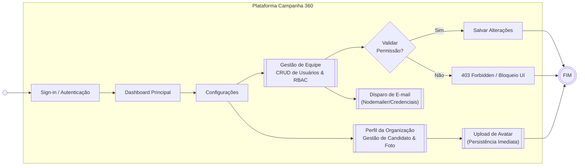

# Campanha 360 - Plataforma de Gestão Eleitoral

**Número:** 00002  
**Analista responsável:** Antigravity AI  
**Entrada:** 08/05/2026  
**Diretoria:** Tecnologia | **Setor:** Desenvolvimento Web  
**Link:** [Preencher]  
**Protótipo:** [Preencher]

---

## Histórico de Versões

| ID | Data e hora | Responsável | Alteração |
| :--- | :--- | :--- | :--- |
| 1.0 | 08/05/2026 | Antigravity AI | Especificação inicial baseada nos módulos de Web |

---

## 1. Introdução

### Visão Geral do Projeto
A **Plataforma Campanha 360** é um ecossistema digital projetado para centralizar e otimizar a gestão de campanhas eleitorais. O sistema permite que candidatos e suas equipes gerenciem desde a identidade visual e informações institucionais até o controle de acesso de colaboradores, garantindo uma operação coordenada e segura durante o período eleitoral.

Diferente de ferramentas genéricas, o Campanha 360 adota uma arquitetura *multi-tenant*, onde cada campanha possui seu próprio domínio e ambiente isolado, permitindo personalização profunda e segurança de dados.

### Objetivos do Sistema
O objetivo técnico desta plataforma é fornecer uma infraestrutura escalável que assegure:
*   **Governança de Dados:** Controle rigoroso de quem pode visualizar ou editar informações sensíveis da campanha via RBAC.
*   **Consistência de Marca:** Centralização da identidade visual (fotos, números, cargos) para uso em todos os materiais digitais.
*   **Agilidade Operacional:** Automatização de processos como o onboarding de novos membros da equipe e gestão de credenciais.

### 1.1. Escopo Funcional (Módulos)
A solução é composta pelos seguintes pilares funcionais:

1.  **Módulo de Autenticação e Segurança:** Gerenciamento de login e recuperação de senha.
    *   [ERS: Autenticação (API)](api/authentication.md) | [ERS: Autenticação (Web)](web/authentication.md)
    *   [ERS: Recuperação de Senha (API)](api/password.md) | [ERS: Recuperação de Senha (Web)](web/password.md)
2.  **Módulo de Perfil da Organização:** Gestão dos dados do candidato e identidade visual.
    *   [ERS: Perfil da Organização (Web)](web/organization-profile.md)
3.  **Módulo de Gestão de Equipe (User Registration):** Controle de colaboradores e RBAC.
    *   [ERS: Gestão de Equipe (Web)](web/user-registration.md)
    *   [ERS: Perfis de Acesso (Web)](web/access-profile.md)
4.  **Módulo de Configurações de Conta:** Gerenciamento de dados pessoais.
    *   [ERS: Minha Conta (Web)](web/account.md)

### 1.2. Perfis de Usuário
*   **Administrador da Campanha:** Acesso total, incluindo gestão de usuários e configurações da organização.
*   **Colaborador/Equipe:** Acesso restrito a funcionalidades específicas (ex: apenas visualização ou gestão de conteúdos).
*   **Candidato:** Perfil focado na visualização de resultados e validação de identidade visual.

---

## 2. Objetivo da Solução Web - Campanha 360
Esta solução visa fornecer uma interface administrativa robusta e intuitiva para a gestão da campanha. Utilizando tecnologias modernas como Next.js e Shadcn/UI, o sistema garante uma experiência de alta performance com feedbacks instantâneos (toasts, skeletons) e segurança em nível de servidor (Server Actions validando permissões).

### Utilização da ERS
A ERS será utilizada para:
*   Padronizar o desenvolvimento dos componentes de UI;
*   Guiar a implementação das Server Actions e validações RBAC;
*   Servir de base para a migração do protótipo (JSON) para a API real (PostgreSQL/Node.js);
*   Assegurar a cobertura de testes funcionais.

### 2.1 Escopo
Esta ERS contempla o **Front-end e Integração de Dados**, incluindo:
*   Fluxo de Autenticação (Sign-in/Password Recovery);
*   Gestão de Perfil Institucional com Upload de Foto;
*   CRUD de Usuários com RBAC;
*   Sistema de Notificações Transacionais (E-mail);
*   Interface Responsiva e Acessível.

### 2.3 Telas Contempladas
1.  **Login:** Acesso seguro à plataforma.
2.  **Dashboard Principal:** Visão geral da campanha.
3.  **Perfil da Organização:** Edição de dados do candidato e upload de avatar.
4.  **Cadastro de Usuários:** Listagem (DataTable) e modais de gestão de equipe.
5.  **Minha Conta:** Gestão de perfil pessoal e segurança.

### 2.4 Definições, Acrônimos e Abreviações
*   **RBAC:** Role-Based Access Control (Controle de Acesso Baseado em Funções).
*   **Tenant:** Instância isolada de um cliente no sistema.
*   **Server Action:** Função do Next.js que executa lógica no servidor com validação automática.
*   **Sonner:** Biblioteca de notificações (Toasts) utilizada no sistema.

---

## 3. Fluxo Geral

---