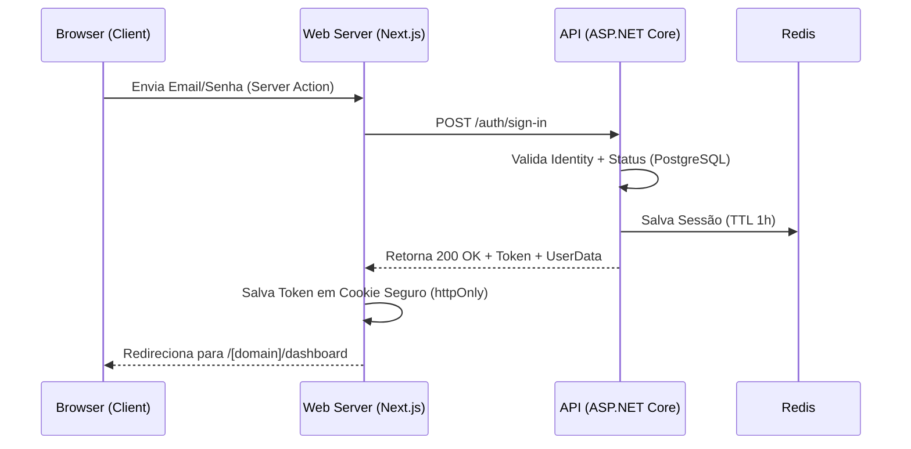

# Integração de Autenticação (Web -> API)

Este documento descreve como o front-end **Web (Next.js)** deve integrar-se ao módulo de autenticação da **API (ASP.NET Core)**, migrando da lógica local (JSON) para chamadas de rede seguras.

## 1. Visão Geral da Arquitetura

A autenticação deixa de ser validada localmente e passa a ser delegada à API. O fluxo utiliza **Next.js Server Actions** para garantir que credenciais e tokens nunca fiquem expostos no lado do cliente (browser).



---

## 2. Implementação das Server Actions

A aplicação Web utiliza Server Actions para mediar a comunicação entre o browser e a API, mantendo o `apiToken` seguro.

### Sign-In (`signInAction`)
- **Arquivo**: `apps/web/lib/action/sign-in-action.ts`
- **Fluxo**:
    1. Recebe `email` e `password`.
    2. Envia para `POST /auth/sign-in`.
    3. Trata erros específicos da API (`401`, `403`, `429`).
    4. Em caso de sucesso, recebe o `SignInResponse` e cria a sessão local.
    5. Redireciona para `/${clientDomain}/dashboard`.

### Sign-Out (`signOutAction`)
- **Arquivo**: `apps/web/lib/action/sign-out-action.ts`
- **Fluxo**:
    1. Recupera o `apiToken` da sessão atual.
    2. Notifica a API via `POST /auth/sign-out` para invalidar a chave no Redis.
    3. Deleta o cookie local e redireciona para `/sign-in`.

---

## 3. Gestão de Sessão Local (`lib/session.ts`)

A sessão no Web é um JWT local assinado com uma `SESSION_SECRET` (armazenada em cookie `httpOnly`).

### Payload da Sessão
```typescript
export interface SessionPayload {
  userId: string;
  domain: string;
  apiToken: string; // Token UUID retornado pela API
  accessProfile?: AccessProfile;
  expiresAt: Date;
}
```

### Validação Ativa com a API
Para garantir que a sessão ainda é válida no Redis (e não apenas no cookie local), o Web utiliza a função `verifySessionWithApi()`.
- **Onde ocorre**: No `app/[domain]/layout.tsx`.
- **Por que**: Evita que um usuário com um cookie válido localmente, mas cuja sessão foi invalidada na API (Redis), continue acessando dados protegidos.
- **Comportamento**: Se a API retornar `401 Unauthorized`, o Web deleta o cookie e redireciona para o login.

---

## 4. Segurança e Multi-tenancy (`proxy.ts`)

O `proxy.ts` atua como um middleware de roteamento e proteção de domínios.

- **Proteção de Dashboard**: Garante que o usuário está logado para acessar qualquer rota `/dashboard`.
- **Isolamento de Inquilino (Multi-tenant)**: Compara o `domain` presente na URL com o `domain` armazenado na sessão. Caso haja divergência, o usuário é redirecionado para o seu domínio correto.
- **Redução de Ruído**: A descriptografia de sessão em rotas públicas (como `/sign-in`) não gera logs de erro no terminal, garantindo um ambiente de desenvolvimento limpo.

---

## 5. Mapeamento de Erros da API

O front-end traduz os códigos de status da API para mensagens amigáveis:

| Código API | Tradução no Web |
| :--- | :--- |
| `401` | "E-mail ou senha incorretos." |
| `403` | "Acesso negado. Entre em contato com o suporte." |
| `429` | "Muitas tentativas. Tente novamente em 1 minuto." |
| `Outros` | "Sistema temporariamente indisponível." |

---

## 6. Configuração de Ambiente

Certifique-se de que o arquivo `.env.local` contenha:
```bash
NEXT_PUBLIC_API_URL=http://localhost:5000
SESSION_SECRET=uma-chave-longa-e-segura
```

> [!TIP]
> Em desenvolvimento, se você alterar a estrutura da sessão na API ou no Web, limpe os cookies do navegador para evitar erros de descriptografia de tokens antigos.
