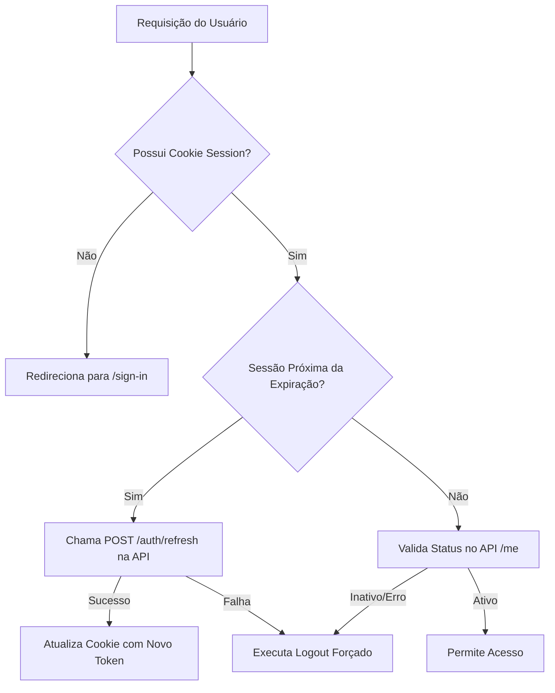

# Gestão de Autorização e Sessão no Frontend (Web)

Este documento descreve como a aplicação Web (Next.js) gerencia a segurança, validação de sessões e integridade dos tokens em sincronia com a API e o Redis.

## 1. Arquitetura de Segurança: O Proxy Middleware

A segurança é centralizada no arquivo `proxy.ts` (Next.js Middleware), que atua como um guardião para todas as rotas protegidas. Ele intercepta as requisições antes que cheguem aos Server Components ou Client Components.

### Fluxo de Validação
O Middleware não apenas verifica a existência de um cookie de sessão, mas também garante a integridade dos dados e a validade da conta em tempo real ou em intervalos definidos.

---

## 2. Validação Periódica e Integridade (Active Validation)

Para garantir que um usuário inativado ou uma sessão revogada no Redis não continuem acessando o sistema, o Proxy implementa uma lógica de **Validação Ativa**.

### Mecanismo de Verificação
Sempre que o usuário interage com o sistema (navegação entre rotas), o Proxy realiza as seguintes verificações:

1. **Sincronia com Redis**: O token armazenado no cookie do navegador é comparado com o estado atual no Redis (via chamada `GET /auth/me` na API).
2. **Status da Conta**: Verifica se o `User`, `Client` ou `AccessProfile` foram desativados administrativamente.
3. **Divergência de Token**: Se o token local for considerado inválido ou diferente do esperado pelo backend (ex: após uma rotação de token em outro dispositivo), a sessão é invalidada.

---

## 3. Logout Forçado (Forced Logout)

O sistema deve interromper o acesso imediatamente e limpar o rastro do usuário se qualquer critério de segurança falhar.

### Gatilhos de Invalidação
- **Inativação**: O administrador desativou o usuário ou a organização no painel administrativo.
- **Revogação de Sessão**: O token foi removido do Redis (ex: Password Reset em outro dispositivo ou expiração manual).
- **Token Mismatch**: Detectada uma tentativa de uso de token expirado ou substituído.

### Processo de Limpeza
Ao detectar uma falha de validação, o Proxy executa automaticamente:
1. **Remoção de Cookies**: Exclusão do cookie `session` e outros cookies de estado.
2. **Limpeza de Cache**: Invalidação do cache do Next.js (`revalidatePath`).
3. **Redirecionamento**: Encaminhamento imediato para a tela de `/sign-in` com uma mensagem explicativa (ex: `?error=session_expired`).

---

## 4. Rotação de Token e Refresh

Para manter a sessão ativa de forma segura, a aplicação utiliza o endpoint `POST /auth/refresh`.

### Implementação no Proxy

---

## 5. Regras de Implementação para Desenvolvedores

1. **NUNCA** armazene tokens de acesso em `localStorage`. Use apenas cookies **HttpOnly** e **Secure**.
2. **Server Actions**: Todas as mutações de dados devem validar a sessão antes de executar lógica de negócio.
3. **Sessão Sensível**: Dados como `ClientId` e `Permissions` devem ser lidos preferencialmente da sessão decifrada no servidor, nunca confiando apenas em parâmetros de URL vindos do cliente.

---

## 6. Checklist de Segurança (Web)

- [x] Middleware configurado para proteger rotas `/[domain]/dashboard`.
- [x] Proteção de rotas públicas contra acesso de usuários já logados.
- [ ] Implementação da chamada de validação ativa no `proxy.ts`.
- [ ] Lógica de limpeza automática de cookies no logout forçado.
- [ ] Integração com fluxo de `refresh` para extensão de sessão.
