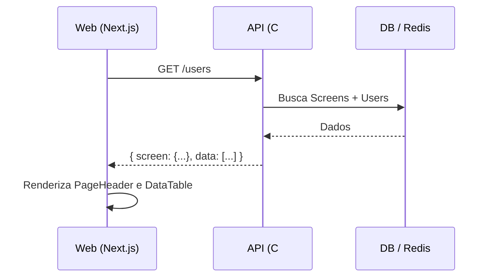

# Documento de Análise Web: Cadastro de Usuários

## 1. Introdução
Este documento detalha o funcionamento do módulo de **Cadastro de Usuários** no Frontend (Next.js). O módulo é totalmente integrado com a API C# e utiliza padrões de **Server Components** e **Server Actions** para garantir segurança e performance.

---

## 2. Arquitetura e Fluxo de Dados

### 2.1. Integração com API
O módulo não utiliza arquivos JSON locais. Toda a comunicação é feita via requisições HTTP para a API:
- **Listagem**: Busca dados via `GET /users`, recebendo os usuários e metadados da tela.
- **Persistência**: Utiliza `POST /users` (Criação) e `PUT /users/{id}` (Edição).
- **Exclusão**: Utiliza `DELETE /users/{id}` (Soft Delete).

### 2.2. Metadados Dinâmicos
O título e a descrição exibidos no `PageHeader` são recuperados dinamicamente da API no momento da listagem. Isso permite que alterações no banco de dados (tabela `Screens`) reflitam imediatamente na UI sem necessidade de deploy.

---

## 3. Controle de Acesso e UI (RBAC)

A interface se adapta dinamicamente às permissões do usuário logado (armazenadas na sessão):

- **Visualização (`view`)**:
    - Se ausente, o usuário é redirecionado pelo middleware ou recebe uma mensagem de acesso negado.
    - Se presente, a tabela é renderizada.
- **Criação (`create`)**:
    - O botão "Novo Registro" no toolbar só é exibido se o usuário possuir esta permissão.
- **Edição (`update`)**:
    - O ícone de edição na tabela só é exibido com esta permissão.
    - Caso contrário, apenas o ícone de visualização (olho) é exibido, abrindo o formulário em modo `read-only`.
- **Exclusão (`delete`)**:
    - O ícone de lixeira e o diálogo de confirmação de exclusão são condicionados a esta permissão.

---

## 4. Componentes e UI/UX

### 4.1. PageHeader Dinâmico
O componente de cabeçalho utiliza o objeto `screen` retornado pela API para exibir:
- **Título**: Ex: "Cadastro de Usuários"
- **Descrição**: Ex: "Gerencie os usuários que têm acesso ao sistema."

### 4.2. Formulário e Validação
- **Password Generation**: O frontend não gera a senha. A API gera e envia por e-mail.
- **Feedback Visual**: Utiliza `Sonner` para notificações de sucesso/erro após as Server Actions.
- **Revalidação**: Após qualquer mutação (Create/Update/Delete), o cache do Next.js é invalidado via `revalidatePath`, garantindo dados frescos.

---

## 5. Fluxo de Trabalho

---

## 6. Checklist de Implementação Web
- [x] Integração total com `/users` (remover JSON).
- [x] PageHeader populado via metadados da API.
- [x] Botões de ação (Novo, Editar, Deletar) condicionados via RBAC.
- [x] Server Actions atualizadas para payload da API.
- [x] Tratamento de erros amigável (Toasts).
- [x] Skeleton loading durante o fetch inicial.
